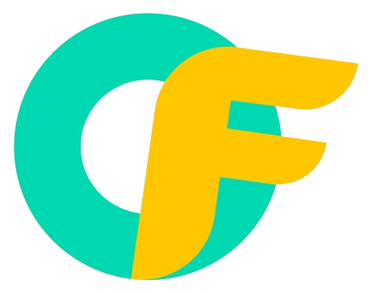

## DripCast

### What does it do

- It is a platform for creators to sell digital products (videos, e-books, images) via Farcaster Frames.
- Users can discover and purchase these digital assets by minting Access NFTs, which grant them access to the purchased content.

### How does it work?

- Creators list their digital products (videos, e-books, images) on the platform, which are encrypted.
- For each listed product, a new Smart Contract is launched through the Smart Contract Factory.
- Users can discover and purchase these products by minting Access NFTs through the Post Frame.
  After purchasing the Access NFT, users can view their purchased digital assets on the Viewing Page.

### Future Features

- Developing a mobile app for a better user experience.
- Implementing social features like commenting, rating, and sharing of digital assets on top of Farcaster.
